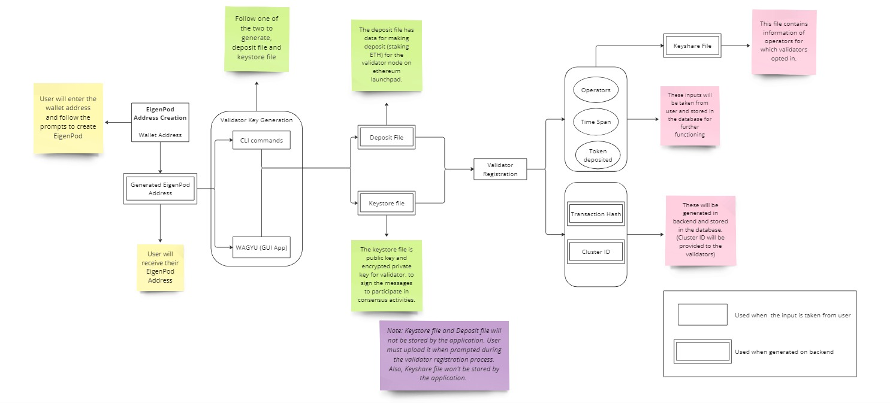

# EasyStake
(Re)staking WebApp using SSV Tech

## Overview
EasyStake is a Restaking Application designed to simplify the process of creating and managing Ethereum validators using SSV's tooling. The platform provides a seamless, user-friendly experience by consolidating multiple steps into a single application. This solution enhances user experience and streamlines validator management through programmatic automation and integration with key Ethereum technologies.

## Flow of the Application


### EigenPod Address Generation

- Users connect their wallet and generate an EigenPod Address.
- If an EigenPod Address already exists, users can view it by clicking the "Get Pod Address" button.

### Keystore and Deposit File Generation

- Users have the option to generate the keystore and deposit files using either CLI Commands or the WAGYU GUI app, depending on their preference.
- This step is informational, with instructions provided to guide the user through generating these files.

### Validator Registration

- Users select the operators to whom they wish to distribute their validator key.
- The keystore file, containing the public key and encrypted private key, is uploaded by the user.
- Users input the amount they want to stake and the time span for their participation in the network.
- Upon successful registration, users receive a keyshare file detailing the operators they have opted for, along with a cluster ID representing the selected operators.

### Deposit Data

- Users upload the deposit file, which contains the necessary data to stake ETH for the validator node on the Ethereum launchpad.

## Features

- **Integrated Wallet Connection:** Simplifies the process of generating an EigenPod Address.
- **Keystore and Deposit File Generation:** Provides both CLI and GUI options for generating necessary files.
- **Validator Registration:** Allows selection of operators and handles key distribution for staking.
- **Automated Deposit Handling:** Guides users through the process of uploading the deposit file for staking ETH.

## Getting Started

Run the development server:

```bash
yarn dev
```

Open [http://localhost:3000](http://localhost:3000) with your browser to see the result.

You can start editing the page by modifying `app/page.tsx`. The page auto-updates as you edit the file.

This project uses [`next/font`](https://nextjs.org/docs/basic-features/font-optimization) to automatically optimize and load Inter, a custom Google Font.
